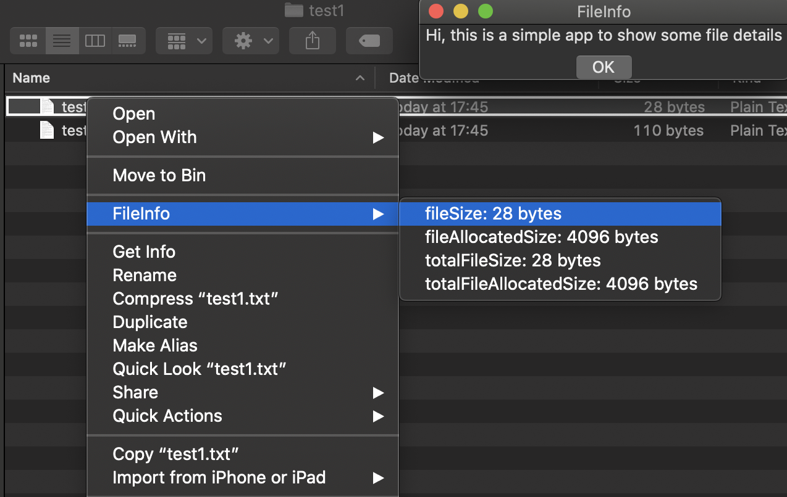
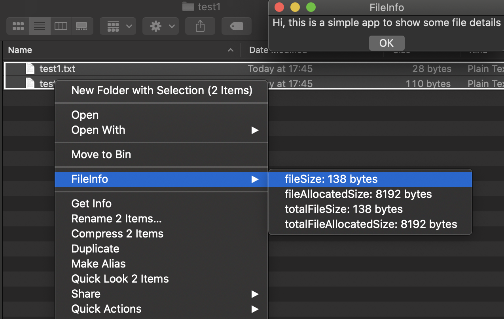

# FileInfoExtension
<i>A simple Finder extension to show some file details</i>

This project implements *FinderSyncExtension* which for selected files shows specific details, which normally aren't available immediately.

<div style="text-align:center"> </div>

## Requirements
* Xcode min. 10.2
* Swift 5
* Nimble min. 9.0.0
* Quick min. 3.0.0

## Important
To ensure that the program is working, access must be granted in *System Preferences -> Extensions -> Finder Extensions*.

Currently selected file details may not be available for directories. To change displayed details, change in *FileInfoFinderExtension/FinderSync.swift* the paramiter *resources* and update the model in *FileInfoFinderExtension/Model/FileInfoMenuItem.swift*. The details are based on [URLResourceKey](https://developer.apple.com/documentation/foundation/urlresourcekey).

```swift
override func menu(for menuKind: FIMenuKind) -> NSMenu {
    // Produce a menu for the extension.
    let menu = FileInfoMenu(title: "FileInfo")
    menu.setInfo(
        with: FIFinderSyncController.default().selectedItemURLs(),
        resources: [.fileSize, .fileAllocatedSize, .totalFileSize, .totalFileAllocatedSize] // To change displayed details
    )
    return menu
}
```